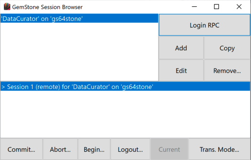
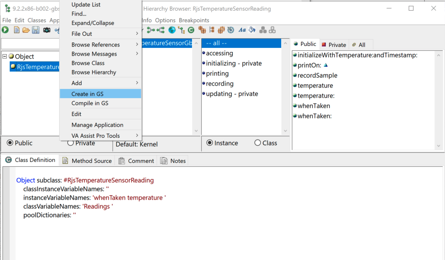
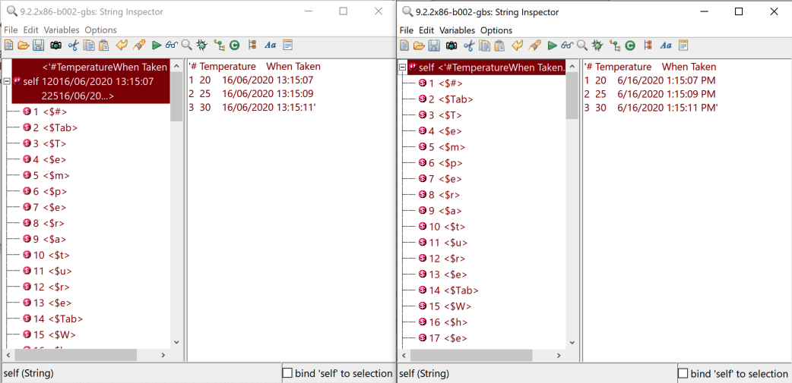

<p align="center">
<!----->
 <h1 align="center">GemStone GBS Examples for VA Smalltalk</h1>
  <p align="center">
    GemStone GBS Examples for VA Smalltalk
    <!---
    <br>
    <a href="docs/"><strong>Explore the docs »</strong></a>
    <br>
    -->
    <br>
    <a href="https://github.com/vast-community-hub/gemstone-gbs-examples/issues/new?labels=Type%3A+Defect">Report a defect</a>
    |
    <a href="https://github.com/vast-community-hub/gemstone-gbs-examples/issues/new?labels=Type%3A+Feature">Request feature</a>
  </p>
</p>

A collection of [GemStone](https://gemtalksystems.com/products/gs64/) [GBS](https://gemtalksystems.com/products/gbs-va/) Examples for [VA Smalltalk](https://www.instantiations.com/products/vasmalltalk/index.html)

## License
- The code is licensed under [MIT](LICENSE).
- The documentation is licensed under [CC BY-SA 4.0](http://creativecommons.org/licenses/by-sa/4.0/).

## Installation

1. Install [VA Smalltalk 9.2.1 or newer](https://www.instantiations.com/products/vasmalltalk/download.html).
2. Install Tonel support in your development image following [this guide](https://github.com/vasmalltalk/tonel-vast#installation).
3. Clone this repository.
4. The easiest and recommended approach is to install it via a script:

```smalltalk
| loader path |
path := (CfsPath named: '<insert path to root gemstone-gbs-examples local repo here>').
loader := TonelLoader readFromPath: path.
loader
	beUnattended; "do not prompt and use all defaults"
	useGitVersion.
loader loadAllMapsWithRequiredMaps.
```

Or you can load the Configuration Map `GemStoneGBSExamples` from the context menu of the Configuration Maps Browser: `"Import"` -> `"Load Configuration Maps from Tonel repository..."` -> select path to root `gemstone-gbs-examples` local repo. This will open a dialog and will use convenient defaults for the load. Refer to [its documentation](https://github.com/instantiations/tonel-vast#using-gui-menus) for more details.


## Setting up GBS

1. Install GemStone GBS for VA Smalltalk following the Installation Guide from [here](https://gemtalksystems.com/products/gbs-va/). As a result, you should have the map `GBSGemBuilder` loaded and a `libgcirpc-xxx` shared library findable by VA Smalltalk.
2. Set the library path. For example:
```Smalltalk
GbsConfiguration current libraryName: 'z:\Common\Development\VAST\9.2x86-b427\libgcirpc-3.4.3-32.dll
```
3. (Optional) Create a stone using [GsDevKit_home](https://github.com/GsDevKit/GsDevKit_home). Example:
```bash
createStone -f -G gs_343_gbs 3.4.3
```
Note that the `-G` is because tODE cannot easily coexist with GBS.

4. Create the GemStone session parameters. Example for a local stone:
```Smalltalk
GBSM addParameters: (GbsSessionParameters new
		gemStoneName: 'gs_343_gbs';
		username: 'SystemUser';
		password: 'swordfish';
		rememberPassword: true;
		gemService: '!@vm-mint64.local#netldi:50400!gemnetobject';
		yourself).
```
Example of a remote stone:
```Smalltalk
GBSM addParameters: (GbsSessionParameters new
		gemStoneName: 'gs64stone';
		username: 'DataCurator';
		password: 'swordfish';
		rememberPassword: true;
		gemService: '!@157.230.4.236#netldi:50377#task!gemnetobject';
		yourself).
```
5. From the `Transcript` main menu `GemStone` -> `Sessions` you should see the registered session parameter and you should also be able to `Login RPC`. Example:




## Running Temperatures Example

1. First thing is to connect to a GemStone session (`Login RPC`) as we did before during GBS setup.
2. Then we must “copy” the definition of `RjsTemperatureSensorReading` from VA Smalltalk to GemStone. For that, we just browse the class, right click, then `Create in GS`.



3. Now that the class also exists on GemStone, here is the final magic:

```Smalltalk
"GemStone Set Up:
    1) Go to GBS and open a session into the stone.
    2) Use GBS to push the class RjsTemperatureSensorReading to the server (right click -> 'Compile in GS'.
    3) Commit.
    4) Execute below lines
"   

| session connector measures |

"initialize the class variable in VAST."
RjsTemperatureSensorReading clearReadings.

session := GBSM currentSession.
connector := GbsClassVarConnector
        stName: #RjsTemperatureSensorReading
        gsName: #RjsTemperatureSensorReading
        cvarName: #Readings.
connector updateSTOnConnect.
connector connectInSession: session.

"initialize the class variable in GemStone."
session evaluate: 'RjsTemperatureSensorReading clearReadings.'.

measures := OrderedCollection new.
measures add: 20 -> DateTime now.
(Delay forSeconds: 2) wait.
measures add: 25 -> DateTime now.
(Delay forSeconds: 2) wait.
measures add: 30 -> DateTime now.

measures do: [:each |
    (RjsTemperatureSensorReading newTemperature: each key asOf: each value) recordSample.
].

((session evaluate: '
    RjsTemperatureSensorReading sampleReport')
        copyReplacing: Character cr withObject: Character lf)
            inspect.
session commitTransaction.  

RjsTemperatureSensorReading sampleReport inspect.
```

That code basically tells GemStone to map the class variable `Readings` from the client Smalltalk (VAST) to itself. Then I hardcoded some temperatures values (in the real example these numbers are replaced with a real temperature sensor and a `TestOneWireDS18B20ThermometerDevice fetchTemperature`), reify a measure object, store the object into the collection, wait 2 seconds, start again. And like that 3 times. Then I commit to GemStone and finally, I make both, VA Smalltalk and GemStone print a report on the class variable `Readings`.

The results, as you expect, are that both Smalltalks have their `Readings` variable correctly and transparently updated:



You can see the 3 measures, at what time they were recorded and what temperature that was (in Celsius).

Note that each report string was generated in two different Smalltalks and how the collection was in sync automatically. It’s funny to see that VA Smalltalk prints dates as MM/DD/YYYY while GemStone does DD/MM/YYYY.

## Blog posts and other media

* [Sensor, process and transparently persist your IoT data with an end-to-end object-oriented system](https://dev.to/martinezpeck/sensor-process-and-transparently-persist-your-iot-data-with-an-end-to-end-object-oriented-system-4e9m)
* [Why is VASmalltalk a great possibility for doing IoT and edge computing?](https://youtu.be/u2AVD_-7E8k?t=1874)

## Acknowledgments
* [Richard Sargent](https://github.com/rjsargent) for all his work on the original code.


## Contributing

Check the [Contribution Guidelines](CONTRIBUTING.md)
